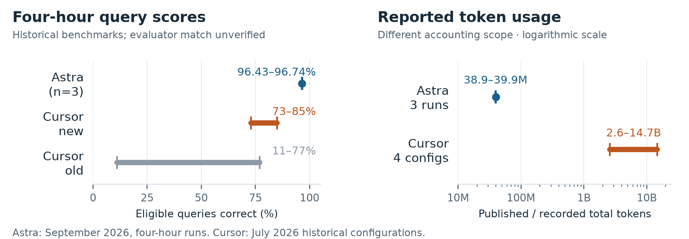

# Can one agent build SQLite in four hours?

A reproducible single-agent experiment inspired by Cursor's [self-driving codebases](https://cursor.com/blog/self-driving-codebases) and [agent-swarm model economics](https://cursor.com/blog/agent-swarm-model-economics) posts.

**Three completed four-hour Astra runs passed 96.43–96.74% of the eligible SQL query suite (median 96.46%, n=3).** A fourth attempt stopped at ~41 minutes and its terminal source did not build. All attempts, checkpoints, regressions, and twelve secondary outcomes are retained.



These results do **not** establish that one agent beats a swarm: models, tools, documentation, time horizons, tests and accounting differ. Query success also does not imply full SQLite compatibility. Only one completed implementation passed the probe that reads its generated database with reference SQLite. [Read the full comparison and caveats →](reports/comparison.md)

## Start here

| Goal | What you need | Start |
|---|---|---|
| Read results and agent strategies | Nothing to install | [Full report](reports/comparison.md), [results data](reports/data/comparison-data.json) |
| Try a saved implementation | Python 3.9+, Docker, Git | Quickstart below; **no inference or account needed** |
| Regrade the saved checkpoints | Above; ~1 GB corpus and substantial compute time | [Grading guide](docs/grading.md) |
| Run a fresh experiment | Above; original Codex CLI and your own Astra access | [Replication guide](docs/replication.md) |

## Try a saved implementation

Tested on macOS with Docker Desktop; Linux is supported by the Python/Docker workflow but has not been end-to-end validated. The build defaults to the original **Linux arm64** target; x86 hosts require Docker's arm64 emulation. Allocate at least 4 CPUs and 6–8 GB to Docker for one worker.

```sh
git clone https://github.com/ericxtang/sqlite-single-agent-study.git
cd sqlite-single-agent-study
python3 replication/manage.py verify
python3 replication/manage.py setup
python3 manual/lab.py console 001
```

At the `001>` prompt, enter one statement per line:

```sql
SELECT 2 + 3 AS five;
CREATE TABLE items(id INTEGER PRIMARY KEY, name TEXT, qty INTEGER);
INSERT INTO items VALUES (1,'apricot',2),(2,'bread',5);
SELECT name, qty FROM items ORDER BY qty DESC;
BEGIN;
UPDATE items SET qty=99 WHERE id=2;
ROLLBACK;
SELECT qty FROM items WHERE id=2;
.quit
```

Expected: `5`; bread/5 then apricot/2; and `5` after rollback. Replace `001` with `002` or `004`. Run `003` intentionally retains its failed terminal build; `003-30min` explicitly selects an older diagnostic checkpoint. [More examples, persistence and file interoperability →](docs/manual-testing.md)

## What is included

- Exact implementation prompts, I/O contract, 416 selected SQLite documentation extracts plus index, and their hashes.
- Frozen scoring code and tests, the 622-file corpus manifest, and a pinned upstream download command. Corpus and expected answers stay outside implementation containers.
- All 55 measured source checkpoints, including the interrupted terminal artifact, with original archive checksums; 66 retained evaluation attempts covering 59 logical jobs, including incomplete infrastructure attempts.
- Portable setup, manual consoles, single-agent controller, no-inference isolation probe, local seals, sequential or up-to-seven-worker grading, and preservation of partial results.
- Full report, charts, reconciled usage aggregates, dated cost scenarios, observable action summaries and selected agent-authored source/notes. Raw private sessions, credentials and platform-provided prompts are excluded.

The source archives and core scoring files are unchanged. Portable wrappers are a **new replication harness**, not a claim that the original machine can be reconstructed exactly. [Changes and limitations →](docs/reproducibility.md)

## Method and budget

Each completed implementation had one Astra (`gpt-6-astra`, `xhigh`) trajectory, a 272k context configuration, four hours, offline Rust tools, 4 CPUs and 4 GiB RAM. Subagents were disabled. Ordinary continuation resumed the same trajectory; seven grading workers later evaluated frozen outputs and were not model agents.

The primary denominator is **5,728,833 eligible query records**, using a frozen sqllogictest revision and external JSON-lines adapter. The twelve secondary probes are a small compatibility sample. [Protocol](PROTOCOL.md) · [Scoring](SCORING.md) · [Formation, measurement and Cursor comparison](reports/comparison.md)

The often-quoted **$70.90–$74.76** is a *hypothetical September 21, 2026 Standard API valuation of recorded subscription usage with observed cache hits*. It is not an invoice or a promised reproduction budget. Without cache discounts, the same recorded tokens value at **$403.97–$416.68**. Setup, supervision, host compute and incomplete-cutoff requests are not included. [Cost assumptions](reports/data/cost-audit.json)

## Validate without inference

```sh
python3 -m unittest discover -s evaluator -p 'test_*.py'
python3 -m unittest discover -s replication -p 'test_*.py'
python3 replication/validate_publication.py
```

[Publication validation details](docs/validation.md) record exactly what was tested. The CI workflow makes no model calls. Fresh implementation commands require `--allow-inference`; no subscription credentials are included or passed to a worker. Do not expose this repository, historical outputs or the corpus to the implementing agent.

Project code and generated implementations are MIT licensed; SQLite materials and dependencies retain their upstream terms. See [LICENSE](LICENSE) and [THIRD_PARTY_NOTICES.md](THIRD_PARTY_NOTICES.md).
