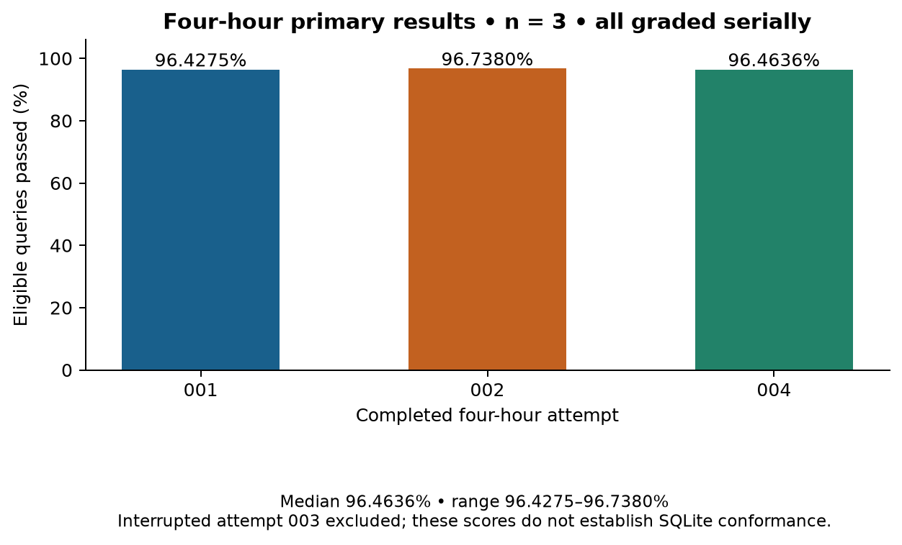
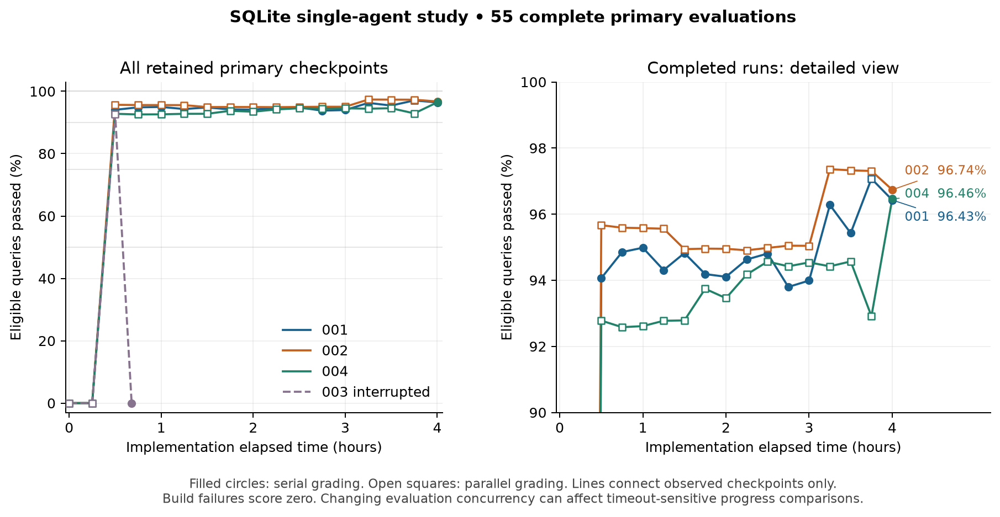
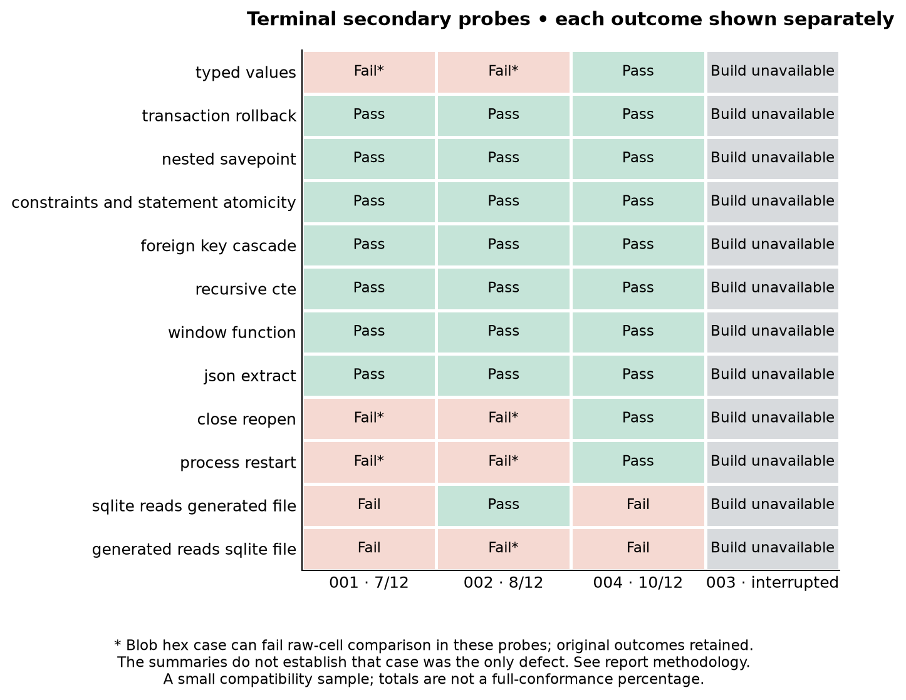
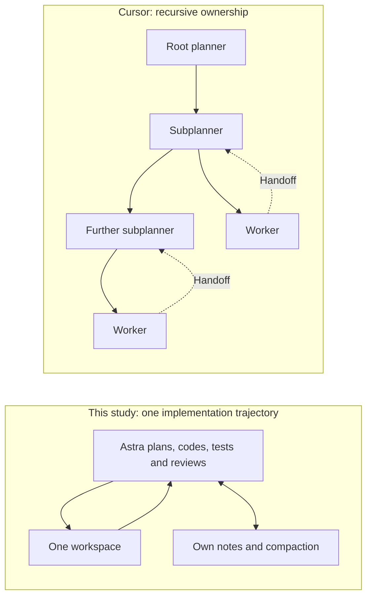

> Public export: links and local identifiers were adapted for this repository. Original source archives and grading outputs are unchanged. Raw session/credential records and platform-supplied prompts are not distributed. See [reproducibility limits](../docs/reproducibility.md).

# SQLite single-agent study: original v1 comparison (under correction)

> **September 21 erratum:** [issue #1](https://github.com/ericxtang/sqlite-single-agent-study/issues/1) confirmed launch-failure classification and blob-comparison defects. All numerical scores, charts, rankings, progress regressions and thresholds below describe preserved **v1 results**, not corrected measurements. The full terminal regrade is pending. The audit recovered several secondary failures, including 002 reading a reference SQLite file. See [Erratum 001](../docs/ERRATUM-001.md) and [the controlled follow-up design](../docs/future-experiments.md).

<!-- executive-summary:start -->

## Executive summary: Astra and Cursor

**Astra reached 96.46% median query accuracy in four hours across three completed runs.** Cursor reported 73–85% for its new swarms at four hours. These are historical results from different models and setups; exact evaluator equivalence is unverified.

Ranges describe runs or model configurations, not confidence intervals. Cursor old includes a run stopped before two hours. Token accounting boundaries differ.

| Dimension | Astra study | Cursor posts |
|---|---|---|
| Agent formation | **1 root agent; 0 subagents.** The same agent plans, codes, tests and reviews. | **Recursive planner/worker delegation.** Specialized contexts, shared decisions and integration agents. |
| Measurement | **5,728,833 eligible sqllogictest queries**, 622 files; three four-hour endpoints. | **Held-out sqllogictest** query pass rate. Exact corpus, filters, adapter and limits are not disclosed. |
| Budget | **$70.90–$74.76** recorded-token API valuation. No-cache scenario: **$403.97–$416.68**. Actual subscription allocation unknown. | **$1,339–$10,565** published controlled-configuration totals. Their accounting period and exclusions are not established as matching ours. |
| Remaining gaps | **7/12, 8/12, 10/12** original secondary outcomes; blob-case caveat affects some failures. High query scores do not prove full SQLite compatibility. | New configurations **later reached 100%**. That later completion is separate from the four-hour scores above. |

**Cost assumptions:** September 21 Standard API rates, using 95–97% observed input-cache hits. These are token valuations, not measured API bills; setup, supervision and grading compute are excluded.

**Interpretation:** Different models, documentation, harnesses and accounting prevent causal conclusions about agent formation or equal-quality cost savings. Interrupted run 003 (40m44s; terminal build failure) is excluded from the three-run summary.

Sources: [Cursor: self-driving codebases](https://cursor.com/blog/self-driving-codebases) · [Cursor: model economics](https://cursor.com/blog/agent-swarm-model-economics) · [audited study data](../reports/data/comparison-data.json) · [cost audit](../reports/data/cost-audit.json). Detailed methods and caveats are in the [full report](../reports/comparison.md).

<!-- executive-summary:end -->

## Study status and headline results

Completed September 21, 2026. The original completion review recorded **59 logical evaluations** as complete (their exact scoring is now under correction): 55 full-corpus primary evaluations and four terminal secondary assessments. Seven additional infrastructure-interrupted grading attempts remain preserved. Grading finished at **10:12:49 a.m. Eastern** (14:12:49 UTC); the original grading queue stopped. Its scheduled monitor remains paused; a separate issue-review monitor now tracks the correction.

One GPT-6 Astra agent at Extra High, given four hours, passed a median **96.4636%** of this study's eligible sqllogictest queries, with a **96.4275%–96.7380%** range across **three completed runs**. Each endpoint used all **5,728,833 eligible queries in 622 files**. All three endpoint builds succeeded. This is strong performance on the selected SQL query benchmark, not evidence of a complete SQLite replacement. The original terminal compatibility totals are **7/12, 8/12, and 10/12**. A subsequent source review identified a blob-hex letter-case issue in the secondary checker that can fail otherwise equivalent values in 001/002; those strict probe failures need the [measurement caveat](#newly-identified-limitation-in-the-frozen-secondary-probes) below. Primary scores and all original grades remain unchanged.

Expanded September 21 with an audit of agent formation and observable traces, comparison to both original Cursor posts, exact-method limitations, and a dated hypothetical API budget valuation. The initial report and its artifact hashes are preserved in the initial revision (retained in the private audit; not bundled).

## Attempts and primary outcomes

| Attempt | Implementation time | Terminal build | Queries passed | Primary score | Statements passed (separate) | Secondary probes |
|---|---|---|---|---|---|---|
| measured-001 | 14,400.078 s · four hours | Pass | 5,524,172 / 5,728,833 | 96.4275% | 180,026 / 210,713 | 7/12 |
| measured-002 | 14,400.070 s · four hours | Pass | 5,541,959 / 5,728,833 | 96.7380% | 189,095 / 210,713 | 8/12 |
| measured-004 | 14,400.057 s · four hours | Pass | 5,526,239 / 5,728,833 | 96.4636% | 191,031 / 210,713 | 10/12 |
| measured-003 | 2,444.264 s · interrupted | Fail → zero | 0 / 5,728,833 | 0.0000% | 0 / 210,713 | 0/12 |

Completed-endpoint statistics use only measured-001, measured-002 and measured-004 (n=3). They are fresh trajectories and workspaces under the same setup; this small same-model sample does not support a precise population estimate. The millions of correlated SQL records are not independent experimental replications. No confidence interval or significance claim is attached to the three-run descriptive summary.

Measured-003 stopped on a subscription limit at **2,444.218–2,444.264 seconds** (40m44s). A controller cleanup error left its worker paused; the terminal source was recovered without resuming the agent or modifying source. Its recovered terminal artifact failed compilation with five Rust errors (E0308/E0425), so its diagnostic primary score is a protocol-valid zero and its secondary probes are all unavailable. The earlier 30-minute artifact scored **92.5607%**. That earlier success was not substituted for the failed terminal artifact. The user explicitly approved the fresh four-hour replacement measured-004 under amendment 001. No implementation was extended or resumed after its stop.

| Discarded pilot | Status | Recorded implementation time | What was evaluated |
|---|---|---|---|
| pilot-001 | Preparation failed before inference | Not started | No SQL result; zero inference records |
| pilot-002 | Operational pilot completed | 1,800.089 s | 45/45 queries in a two-file diagnostic subset; 12/12 pilot secondary probes |

The pilot's two-file diagnostic score is not a full-corpus estimate and is excluded from every measured endpoint, threshold and progress summary. Pilot SQL quality was not a launch gate. No pilot code, notes or trajectory were supplied to measured agents; setup, pilot and supervision accounting are separate.

## Frozen setup and interpretation

The measured setup used **gpt-6-astra, xhigh, 272,000-token context, default service tier, Codex CLI 0.153.0**, and one implementation trajectory per run. Normal compaction, persistent notes, self-authored tests, compilation and ordinary same-trajectory continuation were allowed. Subagents, model reviewers, extra inference from scripts, human implementation edits and adaptive coaching were prohibited. Four implementation CPUs and 4 GiB RAM were available in a pinned offline, non-root Docker environment; the implementation runs were sequential. Each clock counted thinking, tools, compaction, continuation and snapshot overhead. The completed runs exceeded their nominal 14,400-second pause target by only 0.057–0.078 seconds, within the frozen one-second audit tolerance.

Inputs were 416 selected text extracts plus an index from the official SQLite 3.53.4 documentation archive, the fixed task and JSON-lines interface, and Rust with serde 1.0.228, serde_json 1.0.145 and locked utility dependencies. The implementer had no internet, reference engine, source code, hidden tests, prior implementation artifacts, host credentials or Docker socket. Post-run evaluators compiled copied archives; hidden corpus files and expected answers remained outside generated-code containers. These controls establish operational isolation, not absence of possible pretraining exposure to public tests.

The corpus is sqllogictest revision `db57eba95d7c412bb413da5480c8be24109a8faf`. Predeclared SQLite dialect/halt rules excluded 1,466,249 queries and 14,583 statements, leaving 5,728,833 queries and 210,713 statements. Exclusions did not depend on implementation capability. Unexpected setup outcomes, crashes, malformed responses and timeouts taint the remainder of a file; unreached eligible queries remain failures. Ordinary incorrect SELECT outputs do not taint later queries. Fixed limits were 300 seconds per build, 10 seconds per request, a 16-MiB response line and 300 seconds per primary file. Reference validation passed against SQLite 3.51.0, which differs from the 3.53.4 documentation target.

Details: [frozen protocol](../PROTOCOL.md) · [scoring policy](../SCORING.md) · [replacement amendment](../historical/amendment-001/AMENDMENT.md).

## Full progress curves and regressions

Every retained primary checkpoint is shown below. Times in this table are nominal minutes for readability; exact capture times, archive hashes, grading modes and summaries are in comparison-data.json. `0 B` means an unbuildable artifact scored zero. A dash means no observation, not zero. Measured-003's last row is its recovered interrupted endpoint.

| Elapsed minutes | 001 | 002 | 003 interrupted | 004 |
|---|---|---|---|---|
| 0 | 0 B | 0 B | 0 B | 0 B |
| 15 | 0 B | 0 B | 0 B | 0 B |
| 30 | 94.0637% | 95.6665% | 92.5607% | 92.7798% |
| 40m44s (003 terminal) | — | — | 0 B | — |
| 45 | 94.8524% | 95.5907% | — | 92.5799% |
| 60 | 94.9842% | 95.5766% | — | 92.6127% |
| 75 | 94.3075% | 95.5596% | — | 92.7740% |
| 90 | 94.8222% | 94.9419% | — | 92.7854% |
| 105 | 94.1864% | 94.9571% | — | 93.7414% |
| 120 | 94.1053% | 94.9517% | — | 93.4576% |
| 135 | 94.6281% | 94.9066% | — | 94.1749% |
| 150 | 94.8081% | 94.9784% | — | 94.5653% |
| 165 | 93.7975% | 95.0464% | — | 94.4217% |
| 180 | 93.9907% | 95.0420% | — | 94.5405% |
| 195 | 96.2791% | 97.3606% | — | 94.4216% |
| 210 | 95.4269% | 97.3260% | — | 94.5695% |
| 225 | 97.0722% | 97.3063% | — | 92.9128% |
| 240 | 96.4275% | 96.7380% | — | 96.4636% |

| Run | Primary observations | Build zeros | Best observed checkpoint | Adjacent score declines | Largest decline |
|---|---|---|---|---|---|
| measured-001 | 17 | 2 | 97.0722% @ 225.00 min | 6 | -1.0105 pp (150.00→165.00 min) |
| measured-002 | 17 | 2 | 97.3606% @ 195.00 min | 10 | -0.6177 pp (75.00→90.00 min) |
| measured-003 | 4 | 3 | 92.5607% @ 30.00 min | 1 | -92.5607 pp (30.00→40.74 min) |
| measured-004 | 17 | 2 | 96.4636% @ 240.00 min | 5 | -1.6567 pp (210.00→225.00 min) |

The completed trajectories contain 21 adjacent score declines; the interrupted trajectory adds one build-related decline. Runs 001 and 002 peaked before the four-hour endpoint, so selecting their best checkpoint would inflate the endpoint comparison. Run 004 fell from 94.5695% at 3h30m to 92.9128% at 3h45m, then finished at 96.4636%. These are observed score changes, not necessarily isolated code effects: some adjacent checkpoints were evaluated under different concurrency/cleanup revisions, and contention can affect timeouts. No monotonic fit or best-checkpoint substitution is used. Every decline, with before/after values and grading modes, is retained in comparison-data.json.

## Threshold intervals and censoring

| Run | 50% | 75% | 90% | 100% |
|---|---|---|---|---|
| measured-001 | (900.037, 1800.073] s | (900.037, 1800.073] s | (900.037, 1800.073] s | Not observed; censored at 14400.078 s |
| measured-002 | (900.049, 1800.097] s | (900.049, 1800.097] s | (900.049, 1800.097] s | Not observed; censored at 14400.070 s |
| measured-003 | (900.081, 1800.093] s | (900.081, 1800.093] s | (900.081, 1800.093] s | Not observed; censored at 2444.264 s |
| measured-004 | (900.223, 1800.211] s | (900.223, 1800.211] s | (900.223, 1800.211] s | Not observed; censored at 14400.057 s |

All four measured trajectories first had an observed score above 50%, 75% and 90% at their approximately 30-minute checkpoint, following an unbuildable approximately 15-minute checkpoint. The intervals describe adjacent sampled observations; they are not exact first-passage times and cannot exclude an earlier transient crossing followed by regression. No measured checkpoint reached 100%. The three completed runs are administratively right-censored at four hours; 003 is censored at its subscription interruption, not at four hours. Censoring is not a prediction that the threshold would eventually be reached. The pilot subset is excluded.

## All twelve secondary outcomes

| Probe | 001 | 002 | 004 | 003 interrupted |
|---|---|---|---|---|
| typed values | Fail* | Fail* | Pass | Build unavailable |
| transaction rollback | Pass | Pass | Pass | Build unavailable |
| nested savepoint | Pass | Pass | Pass | Build unavailable |
| constraints and statement atomicity | Pass | Pass | Pass | Build unavailable |
| foreign key cascade | Pass | Pass | Pass | Build unavailable |
| recursive cte | Pass | Pass | Pass | Build unavailable |
| window function | Pass | Pass | Pass | Build unavailable |
| json extract | Pass | Pass | Pass | Build unavailable |
| close reopen | Fail* | Fail* | Pass | Build unavailable |
| process restart | Fail* | Fail* | Pass | Build unavailable |
| sqlite reads generated file | Fail | Pass | Fail | Build unavailable |
| generated reads sqlite file | Fail | Fail* | Fail | Build unavailable |

**\* Measurement caveat:** these probes include blob cells whose uppercase/lowercase hex spelling can trigger the frozen raw-cell comparator despite representing the same bytes. The interface did not specify hex case. The summaries do not establish whether this was the only defect. Original outcomes are retained; see [the detailed source evidence](#newly-identified-limitation-in-the-frozen-secondary-probes).

The typed-values, close/reopen and process-restart failures in 001 and 002 are typed-result mismatches in these specific probes. They do not establish that every operation in those feature families is absent. Reading a generated file with reference SQLite failed readback or quick_check for 001 and 004; 002 passed that direction. Reading a reference SQLite file with the generated engine failed for all three: open failures for 001/004 and a typed-result mismatch for 002. Build-unavailable outcomes for 003 are assigned zero by policy without executing the probes. Every raw case result and reason is retained in comparison-data.json.

These twelve predeclared probes cover selected typing, transactions, constraints, SQL features and persistence behavior. Their equal-count totals are a small compatibility sample, not a percentage of all SQLite functionality. Passing close/reopen or process restart does not establish power-loss durability. Concurrency, performance and comprehensive documentation coverage were not evaluated. The probes were validated against reference SQLite before the study freeze.

## Reconciled implementation usage and continuation

The authoritative ledger is [usage-accounting.json](../historical/records/usage-accounting.json). For every attempt that reached inference, unique response_id usage sums match the final raw thread_token_usage exactly. The final report repeats this reconciliation against the retained raw usage.jsonl files. Pilot-001 has no inference records or final thread total; its zeros mean inference never started.

| Attempt | Input | Cached input (subset) | Cache-write input | Output | Reasoning output (subset) | Total |
|---|---|---|---|---|---|---|
| pilot-001 | 0 | 0 | 0 | 0 | 0 | 0 |
| pilot-002 | 1,162,391 | 1,060,608 | 0 | 54,768 | 3,702 | 1,217,159 |
| measured-001 | 39,424,280 | 38,314,368 | 0 | 429,708 | 160,694 | 39,853,988 |
| measured-002 | 39,515,650 | 38,342,912 | 0 | 430,498 | 157,424 | 39,946,148 |
| measured-003 | 1,932,992 | 1,788,672 | 0 | 77,810 | 9,230 | 2,010,802 |
| measured-004 | 38,472,509 | 36,578,048 | 0 | 384,844 | 133,249 | 38,857,353 |

| Attempt | Unique responses | Turns in same trajectory | Compaction events | Operational outcome |
|---|---|---|---|---|
| pilot-001 | 0 | 0 | 0 | Not started |
| pilot-002 | 23 | 1 | 0 | Discarded operational pilot |
| measured-001 | 301 | 1 | 3 | Pass |
| measured-002 | 290 | 1 | 3 | Pass |
| measured-003 | 30 | 1 | 0 | Interrupted; four-hour completion/deadline checks fail |
| measured-004 | 297 | 2 | 3 | Pass |

For the three completed implementations, recorded input-plus-output totals have median **39,853,988** tokens and range **38,857,353–39,946,148** (n=3); their sum is **118,657,489**. Repeated/cached context contributes to these totals. Cached input is already included in input, and reasoning output is already included in output; neither should be added again. All cache-write fields are zero in the recorded telemetry.

Measured-004 used two turns within one trajectory through normal continuation, with the same model and effort and three compactions. This was not another independent implementation agent. Runs 001 and 002 each used one turn and three compactions; interrupted 003 had one turn and no compaction. The three completed operational audits passed. For 003, model, trajectory, prompt, tool-surface, checkpoint-hash, worker-stop and fresh-workspace checks passed; its completion and four-hour deadline checks appropriately failed.

Recorded-response reconciliation does not guarantee accounting for a request still active at cutoff. The compact status.py token_count totals understate completed runs and reset by turn on 004's continuation, so they are not used as the report's usage totals. Setup and supervision usage is excluded and its aggregate is unavailable in these logs; pilot usage is shown separately. All inference used the subscription. Actual subscription allocation is unknown. The [budget comparison](#budget-comparison-time-tokens-and-dollars) values recorded usage under a verified September 21 API rate card and stated assumptions; it is not a subscription invoice or a cost-saving claim.

## Retained source size

| Attempt | Language | Files | Physical lines | Nonblank lines | Bytes |
|---|---|---|---|---|---|
| measured-001 | Rust | 29 | 10,833 | 10,794 | 477,327 |
| measured-001 | Python | 5 | 1,514 | 1,513 | 113,122 |
| measured-001 | shell | 1 | 9 | 9 | 240 |
| measured-002 | Rust | 30 | 2,146 | 2,083 | 353,840 |
| measured-002 | Python | 38 | 1,896 | 1,890 | 141,014 |
| measured-003 | Rust | 17 | 387 | 383 | 155,878 |
| measured-003 | Python | 5 | 203 | 203 | 12,583 |
| measured-004 | Rust | 7 | 12,585 | 12,554 | 548,776 |
| measured-004 | Python | 60 | 2,543 | 2,542 | 146,806 |

These are terminal retained .rs/.py/.sh files, including comments and tests, excluding configuration, documentation and build output. They measure neither code churn nor effective statements. In particular, 002 and 003 pack substantial Rust into very long physical lines, so line counts alone are misleading. Python and shell entries are retained support/test scripts, not additional inference agents. Terminal archive identities and per-file counts are recorded in [implementation-size.json](../reports/data/implementation-size.json).

## Grading execution, build failures and preserved retries

The grader ran from **2026-09-19T18:39:12.350527+00:00** to **2026-09-21T14:12:49.580537+00:00**, a wall span of **43.56 hours**, including handoff, failure review and recovery. The final seven-worker recovery took **12.70 hours**. Completed evaluator elapsed durations sum to **113.41 hours**, with another **1.33 hours** summed across incomplete attempts. These durations overlap during parallel execution: they are neither CPU-hours nor billed compute. Grading time is separate from the four-hour implementation budgets.

| Accepted execution mode | Complete logical jobs |
|---|---|
| Serial, frozen evaluator | 22 |
| Serial evaluation drained during dispatcher handoff | 1 |
| Two-worker dispatcher, frozen evaluator | 2 |
| Seven-worker dispatcher, cleanup recovery adapter | 34 |

All three four-hour primary endpoints, 003's interrupted terminal primary diagnostic and all four terminal secondary assessments were graded serially before parallelization. The two completed jobs under the two-worker dispatcher were 002's initial and 15-minute build-zero checkpoints. The remaining 34 logical outcomes were completed under the seven-worker cleanup adapter. Seven grading workers shared 10 Docker CPUs and about 7.75 GiB RAM while individual containers retained 4-CPU/4-GiB ceilings. Increased contention can affect timeout-sensitive scores and timing. Parallel grading did not change the number of implementation agents, and these data do not establish a sevenfold speedup.

There are **49 successful builds and 10 protocol build-zero evaluations** among the 59 complete jobs. The nine primary build zeros are the initial and 15-minute artifacts for each of four measured attempts, plus 003's interrupted terminal artifact. The tenth is 003's terminal secondary assessment. A build-zero evaluation is a complete, valid protocol result even though no SQL runs; this differs from an infrastructure-interrupted evaluation, whose score remains null.

The first seven-worker dispatch encountered a host PermissionError in frozen process cleanup while evaluating measured-002 at 30 minutes. The dispatcher stopped the other six active evaluations and preserved all seven incomplete outputs. A separate synthetic host-process experiment reproduced an exit race compatible with the error; the original failure's exact process state was not observed. After user authorization, an additive adapter changed only process/container cleanup, retaining the frozen evaluator source, corpus, normalization, scoring and limits. Native-process, fault-injection, seven-concurrent-container and diagnostic checks passed, including 22 recovery tests and 15 original protocol tests. The repair is an operational revision, not evidence that all execution conditions were identical.

The seven retries ran from the beginning in distinct recovery directories; partial per-file results were never merged, substituted or overwritten. The other 27 recovery jobs had not previously run. All 25 previously completed results and all seven incomplete attempts remain byte-identical across 120 preserved evidence files. Thus the accounting is **59 logical results from 66 evaluation attempts**, not 66 independent measurements.

| Incomplete grading attempt | Artifact time | Files scored before interruption | Score | Evidence |
|---|---|---|---|---|
| measured-001 | 225.00 min | 62 | null | [preserved partial summary](../results/measured-001/evaluation/13500-primary/summary.json) |
| measured-002 | 30.00 min | 59 | null | [preserved partial summary](../results/measured-002/evaluation/01800-primary/summary.json) |
| measured-002 | 45.00 min | 22 | null | [preserved partial summary](../results/measured-002/evaluation/02700-primary/summary.json) |
| measured-002 | 60.00 min | 22 | null | [preserved partial summary](../results/measured-002/evaluation/03600-primary/summary.json) |
| measured-002 | 75.00 min | 22 | null | [preserved partial summary](../results/measured-002/evaluation/04500-primary/summary.json) |
| measured-002 | 90.00 min | 24 | null | [preserved partial summary](../results/measured-002/evaluation/05400-primary/summary.json) |
| measured-002 | 105.00 min | 23 | null | [preserved partial summary](../results/measured-002/evaluation/06300-primary/summary.json) |

Recovery details: incident review (retained in the private audit; not bundled) · cleanup addendum (retained in the private audit; not bundled) · explicit retry plan (retained in the private audit; not bundled) · final scheduler event log (retained in the private audit; not bundled) · supervisor log (retained in the private audit; not bundled). The monitor was disabled separately at the user’s request and remains PAUSED; completion required no scheduled wakeup.

## Agent formation: Astra versus recursive delegation

**Astra did not spin off subagents in this study.** This was enforced, not merely a strategy the model happened to choose. The [frozen runtime configuration](../historical/scripts/runtime_config.py) disabled agents and multi-agent features; the [implementation prompt](../inputs/TASK.md) prohibited other agents and models. The available execution path was one offline workspace tool. Within that constraint, Astra planned, edited, compiled, tested and reviewed its own work.

The trace audit found one root session per measured attempt, no parent/fork session, no agent-spawn calls, and only workspace execution beneath the model's `exec` wrapper. Across four attempts, it structurally scanned **7,727 rollout records** and indexed **909 completed workspace commands**. These are different units from the 918 recorded model responses in the usage ledger. Commands can be batched inside a model tool call, and tool discovery or a failed invocation need not produce a completed workspace command. [Trace inventory and source hashes](../reports/data/trace-review.json).

| Attempt | Root sessions | Completed workspace commands | Same-session turns | Compactions | Subagents observed |
|---|---:|---:|---:|---:|---:|
| 001 | 1 | 309 | 1 | 3 | 0 |
| 002 | 1 | 284 | 1 | 3 | 0 |
| 003 interrupted | 1 | 29 | 1 | 0 | 0 |
| 004 | 1 | 287 | 2 | 3 | 0 |

Run 004's second turn was ordinary continuation under the same clock and session, using the existing code and notes. A compaction summarizes one continuing trajectory; it is not a new specialist. The seven concurrent workers requested later were **post-run evaluator processes**, with no implementation-model inference. Four measured attempts are replications, not a four-agent team.

Cursor's February design has a non-coding root planner, recursively spawned subplanners that own narrower scopes, and workers operating in separate repository copies. Workers return findings upward through handoffs rather than coordinating directly with peers. The article describes replacing unsuccessful peer coordination and an overloaded combined executor, and removing an integration bottleneck. Rewritten scratchpads and automatic summaries support continuity. Its large-scale throughput examples concern browser research, not a measured agent count for the later SQLite comparison. [February post: Towards self-driving codebases](https://cursor.com/blog/self-driving-codebases).

July retains planner/worker separation and argues for context specialization alongside parallel execution. [July post: Agent swarms and the new model economics](https://cursor.com/blog/agent-swarm-model-economics).

The operational difference is who holds context and resolves integration. Here, one continuing model context owns both global decisions and local implementation details. There are no concurrent model edits to merge, no separate planner/worker models to price, and no independent model reviewer. The retained code and notes provide external memory, but every new task still passes through the same model trajectory. In the other topology, ownership is subdivided into separate contexts. This experiment cannot determine which topology Astra would choose freely, whether Astra would benefit from delegation, or whether an Astra swarm would beat its single-agent result: delegation was unavailable and no matched swarm arm ran.

## Did we use the same SQLite measuring technique?

**Yes at the level of benchmark family and headline metric; exact evaluator equivalence is unverified.** Cursor describes hidden sqllogictest query correctness, withholding source, tests, binary and internet from a Rust implementation given an 835-page manual, followed by human checks for shortcuts and breadth. [July methodology](https://cursor.com/blog/agent-swarm-model-economics#the-sqlite-experiment).

Our primary score is `eligible query records passed / 5,728,833`, not the percentage of test files passed, SQL statements accepted, manual features implemented, or bytes compatible with SQLite. Expected answers come from the frozen corpus; each query's complete normalized result must match. This follows sqllogictest's central purpose: comparing query answers. Its own documentation explicitly excludes performance, resource efficiency, transactions and concurrency from its scope. [Official sqllogictest description](https://www.sqlite.org/sqllogictest/doc/trunk/about.wiki).

| Comparison dimension | This study's recorded method | What we can establish about an exact match |
|---|---|---|
| Corpus identity | Fixed revision `db57eba95d7c412bb413da5480c8be24109a8faf`; 622 files | Revision/manifest unspecified. |
| Denominator | 5,728,833 queries; statements separate; 1,466,249 queries excluded by fixed SQLite dialect/halt rules | Counts/exclusion rules unspecified. |
| Adapter | Frozen JSON-lines contract with typed cells; separate processes and fresh in-memory databases per file | Adapter/serialization unspecified. |
| Normalization | Frozen I/R/T rendering, sorting, hashes and query labels; blobs decoded before primary normalization | Normalizer/fixtures unspecified. |
| Error propagation | Unexpected setup outcome, crash, protocol error or timeout taints the remainder of that file; unreached queries fail | Unreached-query policy unspecified. |
| Time and build limits | 300-second build, 10-second request, 300-second primary file; unbuildable artifact scores zero | Timeout/build policy unspecified. |
| Checkpoint choice | Hashed source every 15 minutes plus frozen terminal artifact; no repair or best-checkpoint substitution | Snapshot/artifact-selection policy unspecified. |
| Beyond query correctness | Twelve separately reported terminal compatibility probes; operational audits and this trace review | No matching twelve-probe specification. |

These missing details are **limits on verification**, not claims that Cursor necessarily used a weaker or different rule. We reused the measurement concept and benchmark, but built our own frozen evaluator; we did not run a published Cursor evaluator. A score difference could reflect model capability, documentation, adapter behavior, eligibility, timeout pressure, or implementation strategy. It cannot isolate agent formation.

The distinction matters empirically: 001 and 004 earned over 96% while retaining private snapshot formats. Our primary suite starts in-memory databases and does not require native-file interoperability. File formats, transaction behavior, and broader compatibility therefore need separate evidence. Even an eventual 100% query score would not establish a complete SQLite replacement.

### Newly identified limitation in the frozen secondary probes

The source review found that the supplied interface allows an even-length hexadecimal string for a blob without specifying letter case. The frozen secondary checker compares raw typed JSON dictionaries against Python's lowercase `bytes.hex()`. Runs 001 and 002 encode blob cells using uppercase `{:02X}`; 004 uses lowercase `{:02x}`. Thus the same bytes can fail exact secondary comparison solely through spelling, for example `00FF` versus `00ff`. The primary normalizer decodes blobs with `bytes.fromhex`, so this particular raw-string comparison is a secondary-check issue.

Evidence: [interface contract](../inputs/IO_CONTRACT.md), [secondary equality check](../evaluator/secondary.py), [reference cell encoding](../evaluator/slt.py), and byte-identical terminal excerpts for [001](../reports/trace-evidence/measured-001/src/value.rs), [002](../reports/trace-evidence/measured-002/src/value.rs), and [004](../reports/trace-evidence/measured-004/src/value.rs).

Every affected probe contains a blob with alphabetic hex digits. This is sufficient to produce a mismatch for 001/002's typed-values, close/reopen and process-restart probes, and 002's generated-reads-SQLite-file probe, even if the underlying values are correct. The retained summaries do not include the actual failing response, so this review does **not** establish that hex case was the only defect. Their failed probe labels should not be interpreted as proof that persistence or native-file reading is absent. In particular, 002 passed the opposite direction, reference SQLite reading its generated file.

**The original 7/12, 8/12 and 10/12 scores remain unchanged.** No artifact was repaired, no evaluation rerun, and no hypothetical corrected count is reported. This is an identified measurement limitation in the original strict probes, rather than a retrospective change to the primary outcome or ranking.

## Budget comparison: time, tokens and dollars

The matching resource dimension was the nominal **four-hour wall-clock implementation window**, not a common token or dollar cap. Astra used one trajectory during that window; its completed token totals varied. The three completed runs consumed 12 hours of implementation time in aggregate, and the interrupted attempt another 40m44s. The discarded pilot is separate. Grading's 43.56-hour wall span is an additional evaluation cost, not model implementation time.

The original Cursor charts show **billions of tokens**, compared with our approximately 39 million per completed run. The September 21 visual recheck transcribed the following rounded labels. [Original cost and token charts](https://cursor.com/blog/agent-swarm-model-economics), [chart-review record](../reports/data/cursor-chart-review.json).

| Cursor configuration | Published tokens | Published USD | Status in post |
|---|---:|---:|---|
| Opus 4.8 / Composer 2.5 | 2.6 billion | $1,339 | Controlled configuration |
| Grok 4.5 | 3.2 billion | $1,928 | Controlled configuration |
| Fable 5 / Composer 2.5 | 6.7 billion | $2,234 | Controlled configuration |
| GPT-5.5 throughout | 14.7 billion | $10,565 | Controlled configuration |
| Opus 4.8* | 5.5 billion | $5,153 | Informal cost calibration |
| Fable 5* | 12.2 billion | $20,057 | Informal cost calibration |

The footnote calls the starred runs “solo,” but their chart still splits planner and worker tokens. It does not establish a matched one-agent, four-hour control. Their quality was only informally graded. The new swarms' four-hour scores were 73–85%; later completion was 100%. [Original post and footnote](https://cursor.com/blog/agent-swarm-model-economics#fn-1). The earlier [historical baseline](../records/historical-baseline.json) remains unchanged; this chart transcription is additive.

The much larger published token volume is a concrete difference in workload, not merely a choice of per-token prices. Caching also strongly affects our valuation. These observations help explain the dollar gap, but do not identify how much comes from topology, model capability, task coverage, runtime or accounting differences.

Those published dollar totals are not established as four-hour spend with matching exclusions. We do not divide them by our four-hour estimate to claim savings or cost per equivalent result. The original posts also do not provide the per-response token/caching ledger needed to reprice their runs consistently with ours.

We can now provide a **hypothetical Standard API valuation of our recorded usage**, using the official rate card verified **September 21, 2026**: $10 per million uncached input tokens, $1 cached input, $12.50 cache writes and $50 output. Requests above 272,000 input tokens incur higher rates. All recorded requests here were below that threshold (maximum 246,507). The subscription logs report zero cache writes; that does not establish that an API replay would have zero billable writes. [Official pricing](https://developers.openai.com/api/docs/pricing), [Astra context-pricing rule](https://developers.openai.com/api/docs/models/gpt-6-astra).

`Valuation = ((input − cache reads − cache writes) × $10 + cache reads × $1 + cache writes × $12.50 + output × $50) / 1,000,000`

**The cost audit independently resummed every raw response by response ID and matched the authoritative ledger and final raw thread totals.** There is no million-token unit error or omitted reasoning-token surcharge: reasoning is already included in output. The formula now explicitly subtracts cache writes before pricing ordinary input; the previous generic code would double-count nonzero writes, but all recorded writes here are zero, so this fix changes none of the reported dollar totals. Independent audit (retained in the private audit; not bundled), [audited data](../reports/data/cost-audit.json).

This calculation assumes the observed cache hits would also occur on Standard API requests, with no regional uplift. API input is partitioned into ordinary input, cache reads and cache writes; a write is not an extra charge on top of the ordinary input rate. Subscription telemetry does not establish identical API cache behavior. [Official cache accounting](https://developers.openai.com/api/docs/guides/prompt-caching).

| Attempt | Recorded total tokens | Uncached input tokens | Input served from cache | Hypothetical Standard API USD | Scope |
|---|---:|---:|---:|---:|---|
| 001 | 39,853,988 | 1,109,912 | 97.18% | $70.90 | Four-hour implementation |
| 002 | 39,946,148 | 1,172,738 | 97.03% | $71.60 | Four-hour implementation |
| 004 | 38,857,353 | 1,894,461 | 95.08% | $74.76 | Four-hour implementation |
| 003 | 2,010,802 | 144,320 | 92.53% | $7.12 | Interrupted; not four hours |
| Pilot 002 | 1,217,159 | 101,783 | 91.24% | $4.82 | Discarded 30-minute pilot |
| Pilot 001 | 0 | 0 | — | $0.00 | No inference started |

For the three completed runs, the hypothetical median is **$71.60**, range **$70.90–$74.76**, total **$217.26**. Including the interrupted measured attempt gives **$224.38**; adding the discarded pilot gives **$229.20**. None includes setup, supervision, this report, host compute or grading. Cutoff requests may be missing. Actual subscription allocation is **unknown**, not $0 and not these API estimates. The large cached-input share explains why roughly 39 million recorded tokens need not imply 39 million tokens billed at the uncached rate. Run 004's estimate is highest despite the lowest completed total because more of its input was uncached. [Reproducible calculation and assumptions](../reports/data/budget-comparison.json).

For example, 001's $70.898888 consists of **$11.099120 ordinary input + $38.314368 cache reads + $21.485400 output**. Its 39.85 million total tokens include 38.31 million cached input tokens, which receive the $1/million rate in this scenario. The following alternatives use the same recorded tokens and output; they are sensitivity scenarios, not confidence intervals or measured bills.

| Attempt | Recorded categories, Standard | Same read hits; all misses priced as cache writes | No cache reads or writes, Standard |
|---|---:|---:|---:|
| 001 | $70.90 | $73.67 | $415.73 |
| 002 | $71.60 | $74.53 | $416.68 |
| 004 | $74.76 | $79.50 | $403.97 |

Retaining the observed hits while charging all remaining input at the $12.50 write rate adds only $2.77–$4.74. Removing cache discounts altogether increases this valuation to **$403.97–$416.68**. A separate Fast-mode scenario would double the recorded-category Standard values to $141.80–$149.53; the study did not measure such an API run. None of these alternatives changes model behavior or token volume, which an actual replay could change. [Dated rate card and scenarios](../reports/data/cost-audit.json).

**Correct interpretation: $70.90–$74.76 is a recorded-token valuation under observed-cache assumptions, not an established end-to-end price to reproduce a four-hour run.** The telemetry reconciliation is exact within the recorded events; it cannot independently establish billing coverage for an unfinished cutoff request or any backend/internal compaction work outside those events. The three completed runs each have three compactions. No arbitrary allowance is added for unknown usage. A true API cost comparison needs itemized invoice/usage data, service tier, cache-read/write categorization and a shared accounting boundary on both sides.

Our four-hour query scores are numerically above the published historical range, and the rate-card scenario gives useful planning context. The Astra runs occurred two months after the July post and used a different model and documentation package. Neither comparison establishes that single-agent Astra is cheaper at the same quality, that swarms waste their additional budget, or that Astra would reach 100% within a particular cost. A fair next comparison would fix models, input docs, source/adapter, eligible corpus, stop rule and accounting boundary, then evaluate both topologies at equal wall time **and** at equal token/dollar budgets. No such new run is part of this report.

## What the Astra traces show

The review covered all four measured observable trajectories, all public progress messages, tool identities and command records, then inspected representative edits, test outputs and terminal source. Command categories in the data are overlapping keyword-derived navigation aids, not counts of successful features. Passing self-tests are agent-authored evidence and are never substituted for independent grades. All inspection was read-only; no generated program or test was executed during this analysis. [Trace-review data](../reports/data/trace-review.json).

**1. Build a broad integrated SQL interpreter early, then deepen semantics.** Each run handwrote a lexer, Pratt/recursive-descent parser, typed values and relational execution behind the JSON protocol. Rather than assign modules to other models, Astra alternated between global design and direct implementation. All four retained 15-minute artifacts failed to build, but their 30-minute artifacts scored 92.56–95.67%. This is observable early breadth, not evidence of exhaustive feature coverage. See the early [001 timeline](../reports/trace-evidence/measured-001/public-timeline.md) and [004 timeline](../reports/trace-evidence/measured-004/public-timeline.md).

**2. Use documentation to drive a repeated edit–test–review loop.** Traces repeatedly show targeted searches for affinity, NULL rules, conflict handling, foreign keys, window frames, ALTER dependencies and date/JSON behavior, followed by focused regression cases. For example, 001's command at about 225 minutes runs its integrated suites and records 51 smoke, 1,196 regression and 536 property checks plus storage/recovery suites. These are recorded local checks, not hidden sqllogictest results. Its final retained notes describe both implemented areas and remaining gaps. 001 command/output (retained in the private audit; not bundled), [terminal notes](../reports/trace-evidence/measured-001/NOTES.md).

**3. Create additional test oracles, not additional model agents.** Run 004 wrote a seeded 500-operation transactional model test; its recorded output passes that model check. It later added subprocess interruption tests for multi-file commit recovery. Run 002 wrote its own page decoder/structural checks, with recorded passes at 512-, 4,096- and 65,536-byte page sizes. Those programs test the generated implementation without calling another database or model. This broadens verification beyond individual handpicked examples, but the implementation and test expectations can still share the same misunderstanding. 004 model test (retained in the private audit; not bundled), 004 recovery test edit/output (retained in the private audit; not bundled), 002 page tests (retained in the private audit; not bundled).

**4. Choose substantially different storage investments.** Run 001 pursued custom JSON snapshots, OS writer locks and multi-file journaling. Run 004 also kept custom snapshots while extending recovery and SQL behavior. Run 002 replaced early private persistence with a handwritten native page/record codec at about 33 minutes and later worked on overflow, page ownership, corruption, encoding and integrity checks. Interrupted 003 also attempted a native codec before its stop. Thus the similar query scores conceal different engineering scope. The one successful reference-reader interoperability probe belongs to 002, but the strict blob-case caveat limits interpretation of its failed reverse-direction probe. 002 codec edit (retained in the private audit; not bundled), 003 storage tests (retained in the private audit; not bundled), [004 retained architecture](../reports/trace-evidence/measured-004/NOTES.md).

**5. Optimize after semantic breadth.** Run 004 replaced repeated CTE/window-data cloning with shared `Arc` data around 100 minutes; the tool output records a subsequent timed run at 0.047 seconds, alongside a passing regression run. Near 235 minutes it added statement-local caching for uncorrelated subqueries, and a later full suite passed. Runs 001/002 also added bounded/lazy evaluation and subquery reuse. These are concrete performance techniques; local benchmark timings are not independent speed comparisons with SQLite or Cursor. The final score rise cannot be assigned to one optimization from sparse checkpoints. 004 shared-data edit/timing (retained in the private audit; not bundled), cache edit (retained in the private audit; not bundled), subsequent tests (retained in the private audit; not bundled).

**6. Maintain external memory, with imperfect freshness.** Runs 001/002/004 rewrote architecture, test and next-step notes and read them after compaction. Run 001's first compaction is followed by a command that reads `NOTES.md`; 004's continuation starts by reading notes and checking the pending index change. This supports continuity within a single trajectory. It does not provide independent context specialists. Notes can lag code: 003's retained notes still describe private persistence after its page-codec work, and 004's notes include uncached-subquery limitations superseded by its final edits. Treat notes as navigation, not final authority. 001 post-compaction read (retained in the private audit; not bundled), 004 continuation read (retained in the private audit; not bundled), [003 notes](../reports/trace-evidence/measured-003/NOTES.md).

**7. Integration remained a real failure mode.** Run 003's last recorded command edited parser/schema behavior, failed compilation with five Rust errors, then printed passing self-test messages. The shell sequence continued into tests using the older executable and returned exit code zero. Consequently, a green command exit or self-test printout did not prove the current source built. Independent post-run compilation correctly assigned the frozen terminal artifact zero. That is direct evidence for checking build/test provenance, not merely counting reported passes. The broader progress data also retain 21 adjacent score declines among completed runs. 003 final command and output (retained in the private audit; not bundled).

**8. Internal tests and broad code are not equivalent to independent conformance.** The self-test helpers often convert protocol values before comparison; 001's helper uses Python numeric equality, and 002 checks exact type tags only when requested. Such assertions have different acceptance criteria from the frozen secondary raw-cell check. Separately, 004 finished with a 7,846-line engine module despite source formatting and extensive tests; 001 spread its Rust across 29 files and 002 across 30. There is no concurrent merge contention here, but concentration and formatting still affect reviewability. These observations explain why source size, test-count growth and optimistic progress messages should not replace external outcomes. [001 test helper](../reports/trace-evidence/measured-001/tests/smoke.py), [002 test helper](../reports/trace-evidence/measured-002/tests/semantics.py), [size inventory](../reports/data/implementation-size.json).

The following aligns those trace findings with the coordination mechanisms described in the [February architecture](https://cursor.com/blog/self-driving-codebases) and [July revision](https://cursor.com/blog/agent-swarm-model-economics). It compares what each mechanism does, without attributing measured score differences to it.

| Need | Observed Astra practice | Reported Cursor mechanism | Implication for this comparison |
|---|---|---|---|
| Divide work | One owner alternates modules and semantic issues | Recursive planner ownership | No experiment here tests Astra with specialized concurrent contexts. |
| Preserve decisions | Own notes and compaction; some stale notes | Reconciled design documents; shared Field Guide | Continuity for one trajectory differs from synchronizing several trajectories. |
| Review correctness | Self-review, unit/regression/property tests | Varied review agents | Extra test programs do not supply independent model judgment. |
| Integrate edits | Same workspace; build/test loop; 003 stale-binary failure | Custom VCS; neutral merge resolution | Integration still matters with one agent, even without branch conflicts. |
| Control code size | Differently split modules; 004's large engine file | Large-file decomposition | Source layout can constrain reviewability in either topology. |

The comparison is therefore about mechanisms rather than a winner. Astra's own notes serve continuity for one worker; they are not shared organizational memory. Its self-review and property tests provide additional checks; they do not become an independent model review merely because they are separate scripts. One owner avoids conflicts between model-authored branches, while also making planning, implementation and review depend on the same evolving understanding. This study shows that this constrained approach achieved high query scores in four hours with substantial remaining compatibility and measurement caveats. It does not test the alternative formation on the same model.

## Limitations and retained evidence

The primary findings apply to this fixed eligible sqllogictest slice and three completed trajectories. They do not establish production readiness, full SQLite compatibility, a population success rate, unobserved threshold times, or cost superiority. The interrupted fourth attempt is reported rather than silently dropped, but its shorter duration and subscription interruption make it unsuitable for the four-hour cohort. Recovery and concurrency changes particularly limit interpretation of earlier progress curves. All endpoint summaries use the predeclared terminal artifacts, not the best observed checkpoints.

The final read-only validation checked queue coverage and uniqueness, archive identity, per-file eligible/skipped totals, complete summary counts, all twelve secondary case outcomes, all usage reconciliations, original and operational seals, preserved incomplete evidence, and process/container shutdown. It did not rerun an implementation or evaluator. Validation details and raw file SHA256 values are in [final-validation.json](../reports/data/final-validation.json).

| Verified seal | SHA256 |
|---|---|
| Original v1 (retained in the private audit; not bundled) | fbe70d948671242067d3a831016b7095c2a6f4e60ffeb8bbc785f55c727166d5 |
| Amendment 001 (retained in the private audit; not bundled) | 99c002d1fdba7b9ac30d7cdc4edac4b6c86c4f0e8569d9087589ff0a1b8283a5 |
| 59-job queue (retained in the private audit; not bundled) | 6f1a8afbd47d1c47b8f0913517da3bbfc585a349c14611ef77a46709da89c0e1 |
| Two-worker addendum (retained in the private audit; not bundled) | 389891da4a0b1df5e260bfaaf9f5f53ecfd153d66116d9c08d777c1e5f668035 |
| Seven-worker addendum (retained in the private audit; not bundled) | eb14e8f8e9e1db577b7e972bff9f906a94b5acceb3990ab1ded910bdebefba64 |
| Cleanup recovery (retained in the private audit; not bundled) | 62a76ecd53e75bee71d4a5460b83e9f8446aefa3ddb426b931c3e5cca3ad01a0 |

Supporting artifacts: [all job summaries, progress points, regressions, thresholds and accounting](../reports/data/comparison-data.json) · report and plot generator (retained in the private audit; not bundled) · final grader state (retained in the private audit; not bundled). All plots are retained as PNG, SVG and PDF in [reports/plots](../reports/plots). Original run artifacts, build logs, files.jsonl and summary.json paths are included for each job in the data file. Reports are derived artifacts; the frozen inputs and measured results were not edited.

The expanded analysis is reproducible from the read-only trace and budget indexer (retained in the private audit; not bundled) and the sourced analysis text (retained in the private audit; not bundled). Its raw trace hashes are in [trace-review.json](../reports/data/trace-review.json); valuation inputs and assumptions are in [budget-comparison.json](../reports/data/budget-comparison.json). Run the indexer before the report generator to refresh derived artifacts; neither runs generated implementations or grading.

The September 21 cost recheck independently reconciles raw usage in audit_costs.py (retained in the private audit; not bundled) and records the original Cursor chart labels in [a separate chart review](../reports/data/cursor-chart-review.json). The prior report/PDF is preserved in the revision archive (retained in the private audit; not bundled). For post-study hands-on examples, use the manual-testing guide (retained in the private audit; not bundled). Those isolated demonstrations are separate from the frozen measurements and do not revise scores.
